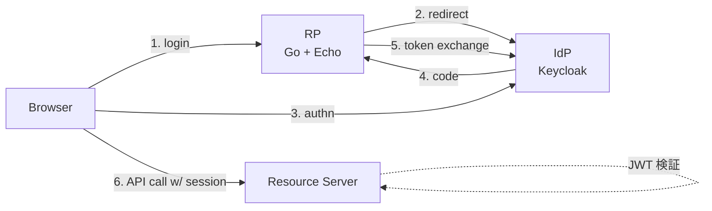

# auth-tuto

認証/認可の勉強を、実コードを書きながら進めるための個人リポジトリ。

## やりたいこと

- OIDC プロトコルによる JWT を用いた認証ロジックの理解と実装
- CSRF など、現代の Web アプリに必須となっている攻撃対策の実装と検証
  - HttpOnly / Secure / SameSite 属性の挙動確認
  - CSRF トークン
  - など

まずは **認証** から。認可はアプリロジックに踏み込む話なので後回し。

## 構成

3 者構成で進める：

- **IdP (OP)**: Keycloak を Docker で起動
- **RP (クライアント)**: Go + Echo。認証フロー、Cookie 管理、CSRF 対策のメイン実装先
- **Resource Server**: 当初は RP と同居。JWT 検証の勉強段階で分離を検討

## 技術スタック

| レイヤー | 選定 |
| --- | --- |
| 言語 | Go |
| Web フレームワーク | [Echo](https://echo.labstack.com/) |
| テンプレート | 標準 `html/template` |
| IdP | Keycloak (Docker) |
| フロント | サーバサイドレンダリング + 素の HTML/フォーム |

SPA 特有の話題（PKCE、トークン保管場所問題など）は、必要になった段階で vanilla JS の最小 SPA を足して扱う。

## ドキュメント

実装フェーズ完了ごとに `docs/` 配下に学習まとめを追記していく。

| ファイル | 内容 |
|---|---|
| [docs/01-oidc-auth-code-flow.md](docs/01-oidc-auth-code-flow.md) | OIDC Authorization Code Flow、JWT 構造と検証クレーム |
| [docs/02-session-cookie.md](docs/02-session-cookie.md) | セッション管理、Cookie の仕組みと HttpOnly 属性 |
| [docs/03-csrf-problems.md](docs/03-csrf-problems.md) | CSRF とは何か、典型的な被害、Login CSRF |

## 学習ロードマップ

走りながら決めるので前後・分岐あり。現状の想定順：

### 認証の基礎（進行中）

- [x] Keycloak を Docker で立てる（realm JSON で宣言的に）
- [x] `/login` → Keycloak authorization endpoint へ redirect
- [x] `/callback` で code を token exchange
- [x] id_token の payload をパースしてユーザー識別
- [x] session をサーバー側（インメモリ map）で管理、session_id を HttpOnly Cookie で保持
- [x] `/me` で Cookie からユーザー情報を返す
- [x] `/logout` で RP セッション削除 + Keycloak `end_session_endpoint` で IdP 側セッション終了
- [x] `state` パラメータで Login CSRF 対策

### CSRF 対策（次ここから）

- [x] 問題の整理（docs/03）
- [ ] SameSite 属性による防御と挙動確認
- [ ] CSRF トークンによる明示的な対策（二重送信 Cookie パターンなど）
- [ ] `/logout` 含む状態変更エンドポイントに CSRF トークン適用

### JWT の扱い

- [ ] id_token の署名検証（JWKS から公開鍵取得 → RS256 検証）
- [ ] `iss` / `aud` / `exp` / `nonce` のクレーム検証
- [ ] `nonce` パラメータ実装（replay 対策）
- [ ] access_token の検証（Resource Server 分離時）

### Resource Server 分離

- [ ] 別プロセスとして Resource Server を立てる
- [ ] `access_token` を Authorization ヘッダで受け取り検証する API

### その他（優先度は都度判断）

- [ ] 設定値の環境変数化（今は main.go に直書き）
- [ ] セッション map を `sync.Map` に置き換える
- [ ] HTML テンプレート（`html/template`）で最低限の UI
- [ ] PKCE（SPA シナリオの勉強時）

### 認可（ずっと先）

認証が固まってから着手。RBAC / ABAC / scope ベースなどを予定。

## 進め方

- 機能単位で一歩ずつ、動作確認しながら進める。
- 大きな設計を先に固めず、走りながら決める。
- ミドルウェアで一発解決せず、まず自分で書いて挙動を理解してから標準実装に置き換え、差分を読む。
