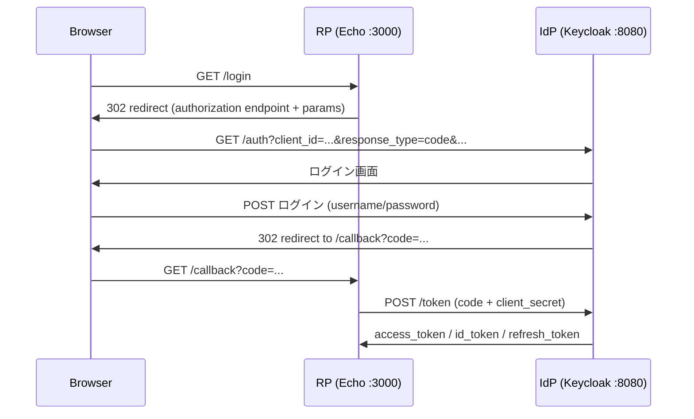

# 01. OIDC Authorization Code Flow

## フロー全体像



## Authorization Code とは

Keycloak がブラウザ経由で RP に渡す**短命な引換券**。

- 一度しか使えない（使用後即無効）
- 有効期限は数十秒〜数分
- それ自体には権限がなく、サーバー間の token 交換にのみ使う

### なぜブラウザに token を直接渡さないのか

code → token の交換は **RP ↔ Keycloak 間（サーバー間）** で行う。これにより：

- token がブラウザの履歴・referer ヘッダに残らない
- `client_secret` をブラウザに露出しなくて済む

ブラウザは code しか受け取らず、token は見えない。これが Authorization Code Flow の核心。

## Token Exchange

`/callback` で受け取った code を、Keycloak の token endpoint に POST して交換する。

```
POST /realms/auth-tuto/protocol/openid-connect/token

grant_type=authorization_code
code=<受け取った code>
redirect_uri=http://localhost:3000/callback   ← /login 時と完全一致が必要
client_id=echo-app
client_secret=supersecret
```

`redirect_uri` は Keycloak 側の登録値と**完全一致**しないと 400 になる（typo 注意: `redirect_url` ではなく `redirect_uri`）。

## 返ってくる3種類のトークン

| トークン | 形式 | 用途 |
|---|---|---|
| `id_token` | JWT | 「誰がログインしたか」を RP に伝える |
| `access_token` | JWT | Resource Server への API コール時に提示する入場券 |
| `refresh_token` | JWT | access_token 期限切れ時の再取得に使う |

RP は id_token を読んでユーザーを識別する。access_token は Resource Server に渡すだけで、RP が中身を読む必要はない。

## JWT の構造

JWT は `.` 区切りの3パート構成：

```
<header>.<payload>.<signature>
```

- **header**: アルゴリズム（RS256 など）と鍵 ID (`kid`)
- **payload**: クレーム（以下参照）
- **signature**: IdP の秘密鍵による署名。改ざん検知に使う

### 検証時に必ずチェックするクレーム

| クレーム | 意味 | チェック内容 |
|---|---|---|
| `iss` | 発行者 | 期待する Keycloak realm URL と一致するか |
| `exp` | 有効期限 | 現在時刻より未来か |
| `aud` | 対象クライアント（id_token のみ） | 自分の `client_id` と一致するか |
| `sub` | ユーザーの一意 ID | アプリ内のユーザー識別に使う主キー |

### 理解しておくと役立つクレーム

| クレーム | 意味 |
|---|---|
| `auth_time` | ユーザーが実際に認証した時刻（`iat` とは別） |
| `sid` | Keycloak 側のセッション ID。ログアウト処理で使う |
| `at_hash` | access_token のハッシュ。id_token と access_token の紐づけ確認に使う |
| `acr` | 認証強度。`0` = SSO 通過（再認証なし） |

### `sub` を使うべき理由

`preferred_username` や `email` はユーザーが変更できる。アプリ DB でユーザーを管理するなら `sub` を主キーにする。

## この時点のコード構成

```
main.go
├── GET /login     → Keycloak の authorization endpoint に redirect
└── GET /callback  → code を受け取り token exchange、トークンを表示
```

定数として `keycloakBase` / `clientID` / `clientSecret` / `redirectURI` を直書きしている（設定外出しは後のフェーズで対応）。
