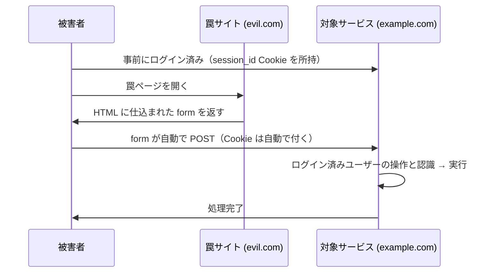
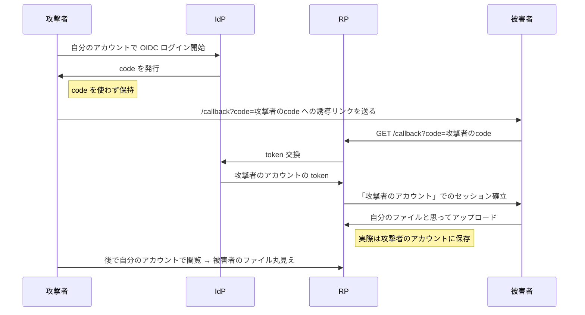

# 03. CSRF という問題

対策は次のドキュメントに回し、ここでは「CSRF とはどういう攻撃で、何が怖いか」をまとめる。

## CSRF とは

Cross-Site Request Forgery。**攻撃者のサイトから、被害者のブラウザを使って、別サービスへのリクエストを勝手に送らせる攻撃**。

### 成立シナリオ

### 根本原因

**Cookie がブラウザによって自動で付く**という仕様がそのまま悪用される。

- リクエストの出所（どのドメインのページから送信されたか）を、サーバー側では区別できない
- 被害者のブラウザは「ログイン済みユーザーからのリクエスト」として振る舞う
- サーバーは区別がつかないのでそのまま処理してしまう

これは Cookie の設計そのものに内在する問題なので、「認証を使う限り対策が必要」になる。

## 典型的な被害

### 金銭的被害
- ネットバンキングで攻撃者の口座に送金
- EC サイトで攻撃者の住所に商品を配送
- 有料サービスの購入

### アカウント乗っ取り
- メールアドレスを書き換えさせ、その後パスワードリセットで乗っ取り
- 旧パスワード不要なパスワード変更 API を直接叩かせる

### 権限昇格
- 管理者のセッションを使って「攻撃者を管理者にする」API を叩かせる
- ユーザー削除、データ削除などの破壊的操作

### データ改ざん / 情報漏洩
- 個人情報の書き換え
- 投稿内容の改ざん
- 公開設定の変更（private → public）

### 歴史的インシデント
- **2008年 mixi「はまちちゃん事件」**: 日記を開くだけで「ぼくはまちちゃん！」という日記が自動投稿される CSRF
- **楽天**: CSRF で勝手に商品購入させられる事例
- **初期 Gmail**: CSRF でフィルター設定を書き換え、受信メールを攻撃者に自動転送させる攻撃

## Login CSRF（OIDC 文脈で特に重要）

普通の CSRF が「被害者のセッションを攻撃者が借用する」のに対し、Login CSRF は真逆。

> **攻撃者のアカウント**に被害者をログインさせる

### 何が嬉しいのか

被害者が攻撃者のアカウントで操作してくれれば、結果が攻撃者のアカウントに蓄積される。後で攻撃者が自分のアカウントに入れば全部見える。

### シナリオ例：クラウドストレージ

被害者からは「勝手にログインしてる？」くらいの違和感しかなく、攻撃者のアカウントに入っていると気付きにくい。

### 被害例
- クラウドストレージへのファイルアップロード
- 検索履歴 / 閲覧履歴の収集
- 決済情報の登録（クレカ番号が攻撃者のアカウントに紐づく）
- プライベートメッセージの下書き

## OIDC における CSRF 脆弱ポイント

OIDC の `/callback` エンドポイントは、**認証フローの中間ステップ**ながら以下の条件を持つ：

- ブラウザから GET でアクセスされる
- クエリパラメータ（code）だけを見て RP セッションを生成する
- Cookie が関与しない

この構造ゆえ、**何の対策もしないと誰でも `/callback?code=xxx` で RP にログインできる**状態になる。これが Login CSRF の温床。

次のドキュメントでは、この問題への具体的な対策（SameSite、CSRF トークン、`state` パラメータ）を扱う。
