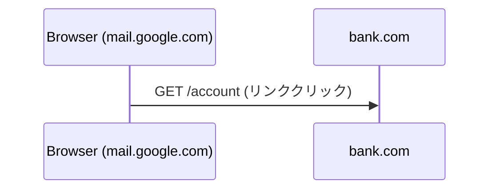
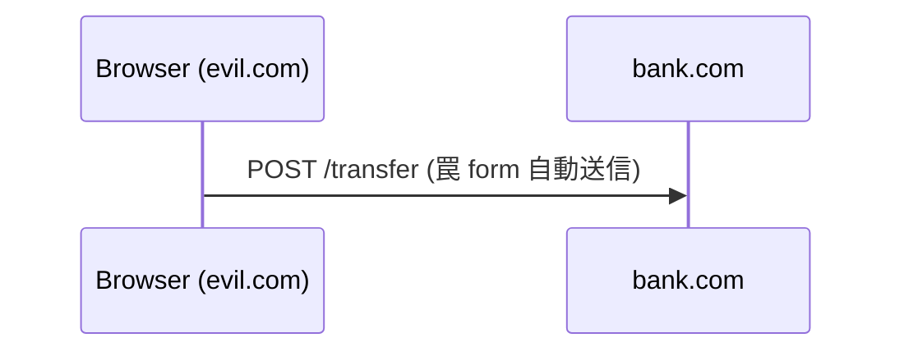
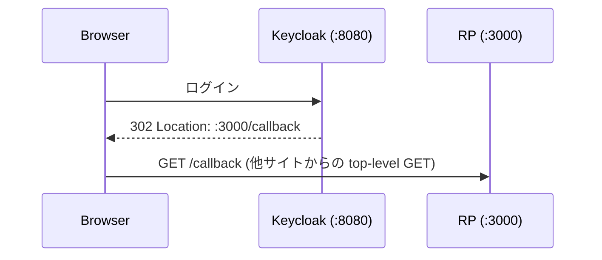

# 04. SameSite Cookie による CSRF 対策

CSRF 対策の第 1 手。**Cookie の送信そのものをブラウザレベルで止める** アプローチ。サーバー側の追加実装は不要で、Cookie 発行時に属性を 1 つ足すだけで効く。

## 前提: SameSite は Cookie の「属性」

Cookie は `name=value` の本体に加えて、**属性**というメタデータを持つ。属性はブラウザに「この Cookie をどう扱うか」を指示するためのもので、サーバーには送り返されない。

```
Set-Cookie: session_id=6f4a...8c2d; Path=/; HttpOnly; SameSite=Lax
             ^^^^^^^^^^^^^^^^^^^^^^ ^^^^^^^^^^^^^^^^^^^^^^^^^^^^^^^^
             name=value (本体)      属性 (メタデータ)
```

| 属性 | 役割 |
|---|---|
| `HttpOnly` | JS からアクセス不可 (XSS 対策) |
| `Secure` | HTTPS 限定 |
| **`SameSite`** | **クロスサイト時の送信可否を制御** |
| `Path` / `Domain` | どこに送るか |
| `Expires` / `Max-Age` | いつまで保持するか |

`SameSite` は別の Cookie でもヘッダでもなく、既存の Cookie にくっつく属性。

## 3 つの値と挙動マトリクス

| シナリオ | Strict | Lax | None |
|---|:---:|:---:|:---:|
| 同じサイト内のリンク・フォーム | ✅ | ✅ | ✅ |
| 他サイトからのリンククリック (トップレベル GET) | ❌ | ✅ | ✅ |
| 他サイトからの 302 redirect (GET) | ❌ | ✅ | ✅ |
| 他サイトからの form POST | ❌ | ❌ | ✅ |
| 他サイトからの fetch | ❌ | ❌ | ✅ |
| 他サイトの `<iframe>` / `` / `<script>` | ❌ | ❌ | ✅ |

Lax と Strict の違いは **「トップレベル GET navigation」1 行だけ**。それ以外は同じ挙動。

### 代表シナリオ

#### ケース A: 他サービスから自サイトへのリンクをクリック



- **Strict**: Cookie 送らない → 未ログイン扱い (UX 劣化)
- **Lax**: Cookie 送る → ログイン状態のまま

#### ケース B: 罠サイトからの POST



- **Strict / Lax**: Cookie 送らない → CSRF ブロック ✓
- **None**: Cookie 送る → CSRF 成立

#### ケース C: OIDC のコールバック



- **Strict**: `oauth_state` cookie 届かず → state 検証失敗で OIDC 壊れる
- **Lax**: 届く → 動く

→ **OIDC コールバック系 Cookie は Strict にしてはいけない**。

## 使い分け指針

| 値 | 使う場面 |
|---|---|
| **Lax** (デフォルト選択) | 一般的な session cookie / auth cookie |
| **Strict** | 管理画面など外部リンクから来てほしくない超慎重用途。2 枚目の「高権限用 cookie」として Lax と併用も |
| **None + Secure** | 他サイトに埋め込まれる前提のサービス (Stripe, Disqus 等) |

迷ったら **Lax**。理由: CSRF を止める・UX を壊さない・OIDC も動く。

## モダンブラウザのデフォルトは既に Lax

Chrome 80+ / Firefox 96+ / Safari 18+ は **SameSite 未指定の cookie を Lax 扱い**する。つまり何も書かない状態でも、実は多くのブラウザで CSRF は既にブロックされている。

だが 明示しないべきではない 理由：

- 古いブラウザは None 相当にフォールバックするものがある
- 「サーバーが意図して Lax にしている」vs「属性を書き忘れている」のが読み手には区別できない
- サードパーティ埋め込み要件が出た時に挙動が変わって事故る

→ **設定は常に明示** が定石。

## 今回の実装

対象 Cookie:

| Cookie | 発行箇所 | 値 |
|---|---|---|
| `session_id` | `handleCallback` | `Lax` |
| `oauth_state` | `handleLogin` | `Lax` (Strict は OIDC が壊れる) |
| `session_id` 削除用 | `handleLogout` | 発行時と揃える |

Go の書き方:

```go
&http.Cookie{
    Name:     "session_id",
    Value:    id,
    HttpOnly: true,
    Path:     "/",
    SameSite: http.SameSiteLaxMode,
}
```

`net/http` の定数:
- `http.SameSiteLaxMode`
- `http.SameSiteStrictMode`
- `http.SameSiteNoneMode` (`Secure: true` 必須)

### 削除用 cookie の属性揃えについて

セッションを失効させる時は `MaxAge: -1` の Cookie を Set-Cookie で返す。このとき **発行時と同じ属性 (SameSite / Path / Domain) で返さないと、ブラウザが「別の Cookie」と見なして削除を無視する**実装がある。発行時 Lax なら削除時も Lax。

## 攻撃・防御サイクルで確認したこと

### 攻撃成立の再現 (SameSite=None; Secure)

1. `session_id` の Cookie に `SameSite: http.SameSiteNoneMode, Secure: true` を設定
2. ブラウザの Cookie を全削除 → legit (`:5173`) にログイン
3. evil (`:5174`) のページでボタンを押す
4. → legit に戻るとログアウトされている (CSRF 成立)

DevTools の Network タブで `/logout` リクエストに `Cookie: session_id=...` が付与されているのが観察できる。

`http://localhost` / `http://127.0.0.1` はブラウザが secure context と扱うので、HTTPS なしでも `Secure` 付き cookie が成立する (これは dev 環境特有の挙動)。

### 防御成立の確認 (SameSite=Lax)

1. `SameSite: http.SameSiteLaxMode` に変更
2. Cookie 削除 → ログインし直し
3. 同じ evil ページでボタンを押す
4. → legit に戻ってもログイン状態が維持されている

Network タブで `/logout` のリクエストヘッダを見ると、**`Cookie` ヘッダそのものが送られていない**。サーバー側は cookie 無しで 401 を返す。

## SameSite だけでは足りない理由

CSRF 対策として強力だが、これ 1 枚に頼り切れない理由がある。

### サブドメインからの攻撃は止められない

`SameSite` の「同じサイト」は **eTLD+1 で判定** される。`evil.example.com` と `app.example.com` は同じ `example.com` として扱われるので、サブドメインに XSS を食らった時点でサブドメイン経由 CSRF は通ってしまう。

### 古いブラウザ / 非ブラウザクライアント

- 古いブラウザは SameSite を無視して None 相当で送る可能性あり
- ブラウザ以外からの攻撃 (CLI / プロキシ経由) にはそもそも無関係

### Lax は状態変更 GET を守らない

Lax は **トップレベル GET を許可**するので、もし状態変更を GET で受け付けている API があれば、`<a href="...">` クリックだけで CSRF が成立してしまう。

→ **「状態変更は POST で受ける」** は CSRF 対策としても重要な設計原則。

### 多層防御へ

以上の穴を埋めるため、次以降のフェーズで **CSRF トークン / Origin 検証** を重ねていく。SameSite は "最初の砦" であって "唯一の砦" ではない。

## 次のフェーズ

- [Synchronizer Token パターン](./05-...) で明示的な CSRF トークン方式を導入予定
