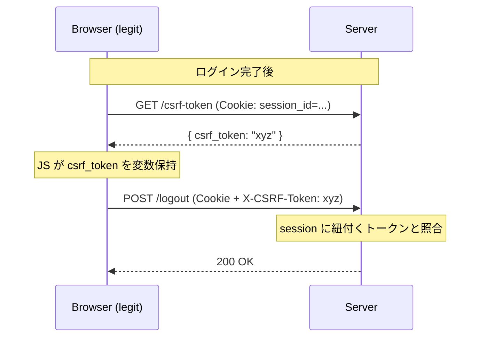
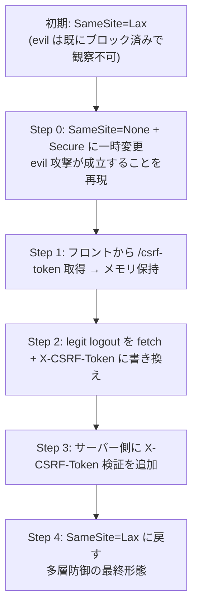

# 05. Synchronizer Token パターン

CSRF 対策の第 2 手。**サーバーが発行した秘密値をリクエストに要求する** アプローチ。SameSite が効かない環境や、アンチパターンな API（GET で状態変更など）に対する保険として効く多層防御の一枚。

## なぜ SameSite だけでは足りないか

`docs/04` の末尾でも触れた通り、SameSite には穴がある。

- サブドメイン XSS: `evil.example.com` から `app.example.com` へのリクエストは同サイト扱い → Cookie が届く
- 古いブラウザ / 非ブラウザクライアント: SameSite を無視するものがある
- Lax は top-level GET を通す: 状態変更を GET で受ける API があれば `<a href>` クリックだけで成立

どれも **「ブラウザが Cookie 送信を止める」という前提が崩れる** シナリオ。Cookie が届いてしまう以上、Cookie だけに紐付いた認証は守れない。

→ **Cookie とは別の経路で「このリクエストは正規ページから来た」を証明** させる必要がある。

## 基本発想

リクエストのたびに、**セッションに紐付いた秘密値 (CSRF トークン)** をヘッダや body に載せさせる。サーバーは受け取った値とセッションに保存した値を照合、一致しなければ弾く。



罠サイトの場合:

```mermaid
sequenceDiagram
    participant E as Evil (127.0.0.1:5174)
    participant B as Browser
    participant S as Server

    Note over E: 被害者が罠ページに訪問
    E->>B: <form action="localhost:3000/logout" method=POST>
    B->>S: POST /logout (Cookie: session_id=... ※SameSite=Noneなら届く)
    Note over S: X-CSRF-Token ヘッダが無い
    S-->>B: 403 Forbidden
```



## なぜこれで防げるのか — SOP / CORS の上に立つ

「攻撃者はトークンを知らない」が前提。これはブラウザの **Same-Origin Policy (SOP)** と **CORS** によって保証される。

| 攻撃者がやれること | 成立するか |
|---|---|
| `/csrf-token` を fetch で叩く | 叩ける。だが **レスポンスは読めない** (CORS で `AllowOrigins` に入ってないので JS に中身が渡らない) |
| `<form>` で POST する | Cookie は送れる。だが **カスタムヘッダ (`X-CSRF-Token`) は付けられない** |
| `fetch` で POST にヘッダを付ける | ヘッダを付けると preflight が飛ぶ。CORS で許可されていない Origin なら実リクエストが飛ばない |

つまり：

- **フォームはヘッダを付けられない**
- **fetch はヘッダを付けられるがレスポンスを読めない / preflight で止まる**

この「片方ずつしかできない」を組み合わせて守っている。Synchronizer Token は単体で成立する対策ではなく、**SOP / CORS が機能する前提** に乗っている層。どれかが破れれば崩れる — だからこそ他の層 (SameSite, Origin 検証, CSP) と重ねる。

## 今回の実装

### Phase 1: サーバー側のトークン発行 ✅

**`backend/main.go`**

```go
type sessionData struct {
    Sub               string `json:"sub"`
    PreferredUsername string `json:"preferred_username"`
    IDToken           string `json:"id_token"`
    CSRFToken         string `json:"-"`  // ID Token の payload Unmarshal 対象外
}
```

セッション作成時 (`handleCallback`) にトークンを発行してセッションに紐付け：

```go
sessionData.CSRFToken = uuid.NewString()
```

取得用エンドポイント:

```go
e.GET("/csrf-token", handleCSRF, RequireSession)
```

`handleCSRF` は `RequireSession` で `session_id` Cookie を検証してからトークンを JSON で返す。未ログインには 401。

**なぜ `json:"-"`**: `sessionData` は ID Token の payload を `json.Unmarshal` する対象にも使われている。将来 Keycloak が `csrf_token` クレームを返したら意図せず上書きされるのを避けるため。本来は「ID Token クレーム用の struct」と「セッションデータ用の struct」を分けるのが筋（TODO）。

**なぜ未ログインに返さない**: トークンは「このセッションが期待する秘密値」。セッションが存在しない状態で発行しても意味がない上、攻撃者に何らかの値を渡すのはノイズ。

### Phase 2: サーバー側の検証 ✅

状態変更エンドポイントに付ける `RequireCSRF` ミドルウェアとして実装。`RequireSession` で解決済みのセッションを使い、`X-CSRF-Token` ヘッダとセッション内のトークンを照合する。

```go
e.POST("/logout", handleLogout, RequireSession, RequireCSRF)
```

```go
sd := c.Get(ctxKeySession).(sessionData)
gotCSRF := c.Request().Header.Get("X-CSRF-Token")
wantCSRF := sd.CSRFToken

if gotCSRF == "" || subtle.ConstantTimeCompare([]byte(gotCSRF), []byte(wantCSRF)) != 1 {
    return c.NoContent(http.StatusForbidden)
}
```

ポイント:

- **ヘッダから取る (`Header.Get`)**: Cookie から取るパターン (Double Submit Cookie) は別物。Synchronizer Token は「Cookie 以外の経路でも証明させる」が本質なので、ヘッダ読みでなければ意味がない。
- **`subtle.ConstantTimeCompare` を使う**: 秘密値の比較でタイミング攻撃を防ぐ定数時間比較。戻り値は `int` (1 = 等しい / 0 = 異なる or 長さ違い)、`!= 1` 判定が定型。本ケース (ランダム UUID) では現実的な攻撃にはならないが、HMAC 検証や API キー比較で必要になる作法を体に入れる目的。
- **空文字早期 return**: `gotCSRF == ""` は subtle 側でも長さ違いで弾けるので冗長。だが攻撃者が常に観測できる情報なのでタイミング情報の漏洩にはならず、可読性のため残してある。
- **`RequireSession` と分離**: セッション解決は `RequireSession`、CSRF 検証は `RequireCSRF` に分ける。`RequireCSRF` は `ctxKeySession` を前提にするので、状態変更エンドポイントでは `RequireSession` → `RequireCSRF` の順で付ける。

### Phase 3: フロントエンド側の取得 & 送信 ✅

#### 3-a. トークンの取得

`frontend/src/main.js`:

```js
let csrfToken = null

async function route() {
  // ...
  const me = await fetchMe()
  if (!me) {
    renderAnonymous()
    return
  }
  csrfToken = await fetchCsrfToken()
  renderLoggedIn(me)
}

async function fetchCsrfToken() {
  const res = await fetch(`${API}/csrf-token`, { credentials: 'include' })
  if (!res.ok) return null
  const data = await res.json()
  return data.csrf_token
}
```

ポイント:

- **モジュールスコープの `let` 変数**: `localStorage` / `sessionStorage` には入れない。XSS が刺さった瞬間にしか盗まれない (= 永続化しない) のと、ページリロードで揮発させたいから。永続化する必要のない秘密値は永続化しないのが原則。
- **`/me` 成功後にだけ取得**: 未ログイン状態でトークン発行依頼しても意味がない (サーバー側も 401)。`fetchMe` → `fetchCsrfToken` の直列。
- **`credentials: 'include'`**: クロスオリジン (`:5173` → `:3000`) なのでデフォルト (`same-origin`) では Cookie が送られない。明示が必要。

#### 3-b. ログアウトの送信

旧コードは `<form>` 生成 + `form.submit()` だったが、フォーム送信ではカスタムヘッダを乗せられないので `fetch` に書き換え:

```js
async function logout() {
  const res = await fetch(`${API}/logout`, {
    method: 'POST',
    credentials: 'include',
    headers: { 'X-CSRF-Token': csrfToken },
  })
  if (!res.ok) {
    console.error('logout failed', res.status)
    return
  }
  const { logout_url } = await res.json()
  window.location.href = logout_url
}
```

| 旧 (`<form>` POST) | 新 (`fetch`) |
|---|---|
| ブラウザがリダイレクトを自動追従 | フロント JS が `location.href` で能動的に top-level 遷移 |
| カスタムヘッダ追加不可 | `headers: { 'X-CSRF-Token': ... }` を載せられる |

#### 3-c. サーバー側のレスポンス形式変更

3-b に合わせて `handleLogout` を `c.Redirect` から `c.JSON` に変更:

```go
return c.JSON(http.StatusOK, map[string]any{
    "logout_url": logoutURL.String(),
})
```

なぜ変更が必要か:

- **fetch では Keycloak への 302 を辿れない**: クロスオリジン redirect の追従には Keycloak が `:5173` 向けの CORS 許可を返す必要があり、Keycloak はそういう設定になっていない。
- **fetch はそもそも画面遷移させない**: 仮に redirect を辿れても、fetch の通信が次の URL に行くだけで、ブラウザのアドレスバーは動かない。
- **OIDC `end_session_endpoint` は top-level navigation 前提**: Keycloak の IdP 側 Cookie はブラウザが top-level で叩いた時に届くようになっている (ここでも SameSite が効いている)。fetch の中ではダメ。

→ サーバーが「次に行くべき URL」を JSON で渡し、フロントが `location.href` で遷移する SPA + OIDC の典型構成に変更。

### Phase 4: 動作確認 ✅

#### 検証用に SameSite を一時的に緩めた

このプロジェクトの初期状態では Cookie は `SameSite=Lax`。この状態だと evil (`127.0.0.1:5174`) からの form POST には **そもそも Cookie が届かない (Lax がブロック)** ため、サーバーが Synchronizer Token を見るより先に「セッション無し」で 401 になる。これでは Synchronizer Token が機能しているかどうか観察できない。

そこで以下の手順で進めた:



- `SameSite=None` には `Secure: true` が必須 (ブラウザが `Secure` 無しの None を拒否する)。`localhost` / `127.0.0.1` は HTTP でも secure context 扱いされる特例があるので、HTTPS 化なしで動く。
- Step 4 が完了した時点で **SameSite=Lax + Synchronizer Token の多層防御** が最終状態。

#### 観察結果

| 経路 | Step 0 (None で攻撃成立を確認) | Step 3 完了時 (None で Synchronizer Token 単独防御) | Step 4 完了時 (Lax に戻して多層防御) |
|---|---|---|---|
| legit fetch + X-CSRF-Token | 200 → ログアウト成功 | 200 → ログアウト成功 | 200 → ログアウト成功 |
| evil form POST | **302 → ログアウト成功 (= 攻撃成立)** | **403 Forbidden** (CSRF check で捕獲) | **401 Unauthorized** (SameSite で先に捕獲) |

ステータスコードが Step 3 → Step 4 で **403 → 401** に変化するのが学習ポイント:

- **403**: Cookie は届いているが `X-CSRF-Token` ヘッダが無い / 値が違う → サーバーまで攻撃が到達してから CSRF 層が捕獲
- **401**: Cookie 自体がそもそも届いていない → SameSite=Lax がブラウザ段階で先に捕獲

つまり Step 4 では Synchronizer Token は今回のテストケースに限れば「働かなくても済んでいる」(SameSite が手前で全部弾く)。それでも残すのは、SameSite が破れる状況 (サブドメイン XSS / 実装バグ / 古いブラウザ) で **もう一枚のドア** として機能させるため。defense in depth の意味がここで実体化する。

```mermaid
sequenceDiagram
    participant E as Evil (:5174)
    participant B as Browser
    participant BE as Backend (:3000)

    Note over E: 罠ページに被害者が訪問
    E->>B: <form action=":3000/logout" method=POST>

    rect rgb(220, 235, 255)
    Note right of B: Step 4 (SameSite=Lax の場合)
    B->>BE: POST /logout (Cookie 無し ※Lax がブロック)
    BE-->>B: 401 Unauthorized
    end

    rect rgb(255, 235, 220)
    Note right of B: Step 3 (SameSite=None の検証時)
    B->>BE: POST /logout (Cookie 届く)
    Note over BE: X-CSRF-Token ヘッダ無し
    BE-->>B: 403 Forbidden
    end
```



## TODO / 今回スコープ外

実装として削った / 後回しにした項目。多くは「一人用 study 環境では実害なし、だが本番では必要」系。

- **`Cache-Control: no-store` 未設定**: `/csrf-token` はユーザー別の秘密値を返す GET API。中間プロキシやブラウザキャッシュに乗ると別ユーザーに漏れる。本番では必須
- **トークンのローテーション未実装**: 現状はセッション生存期間中ずっと同じトークン。教科書的にはログイン直後や権限昇格時にローテーションして漏洩時の被害を最小化する
- **状態変更エンドポイントへの適用ルール**: 現状の状態変更は `/logout` のみ。今後 `POST` / `PUT` / `PATCH` / `DELETE` を追加する場合は、原則 `RequireSession` と `RequireCSRF` を付ける
- **`sessionData` struct の責務混在**: ID Token クレームのパース先とセッション状態保持を同じ struct で兼ねている。本来は分けるべき
- **`sessions` map のスレッド安全性**: 既存 TODO。`sync.Map` か `sync.RWMutex` 化
- **トークンの失効タイミング**: セッション削除時に一緒に消えるだけ。セッション内で明示的に使い捨てる (one-time token) 方式は取っていない

## 次のフェーズ

- **docs/06**: JWT 署名検証。JWKS から公開鍵を取得し、ID Token を RS256 で検証する
- **Origin / Referer ヘッダ検証**: fetch / form 共通で改ざん不可な情報による絞り込み (CSRF 防御のもう一枚の層)
- **Double Submit Cookie パターン**: Synchronizer Token のサーバー側状態保持とのトレードオフ比較として後続候補
- Resource Server 分離 → access_token 検証 → PKCE の順を予定
