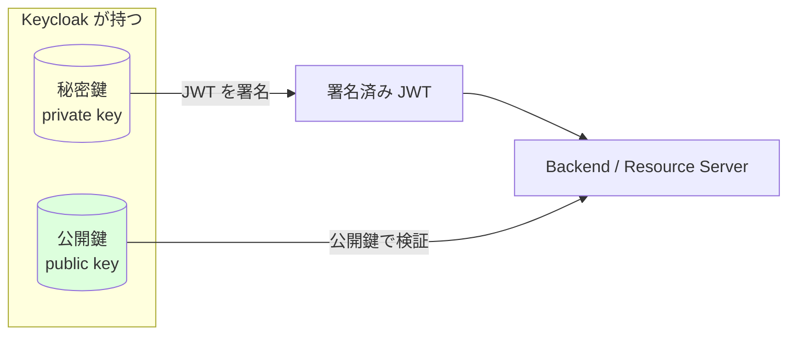
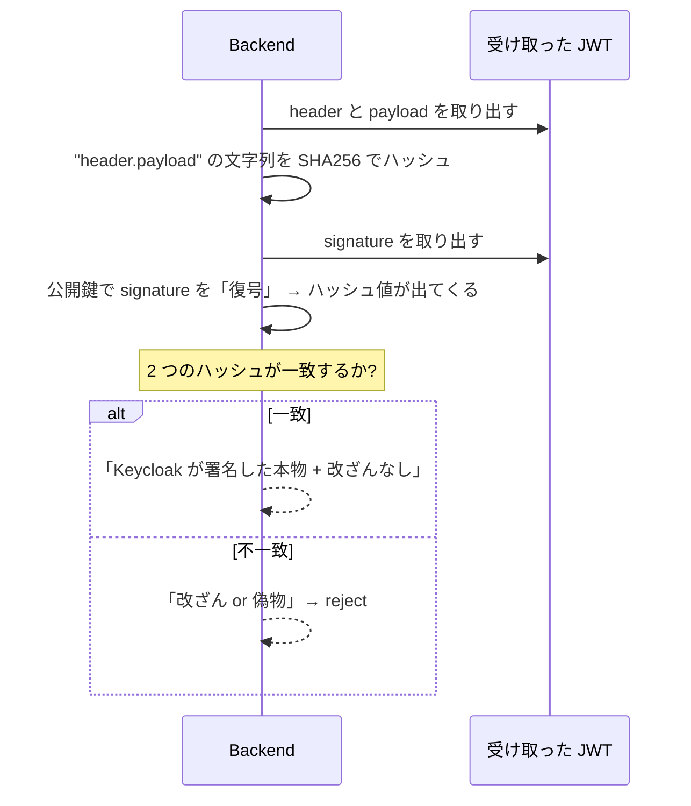
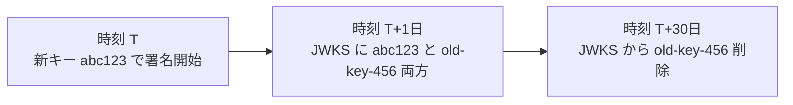
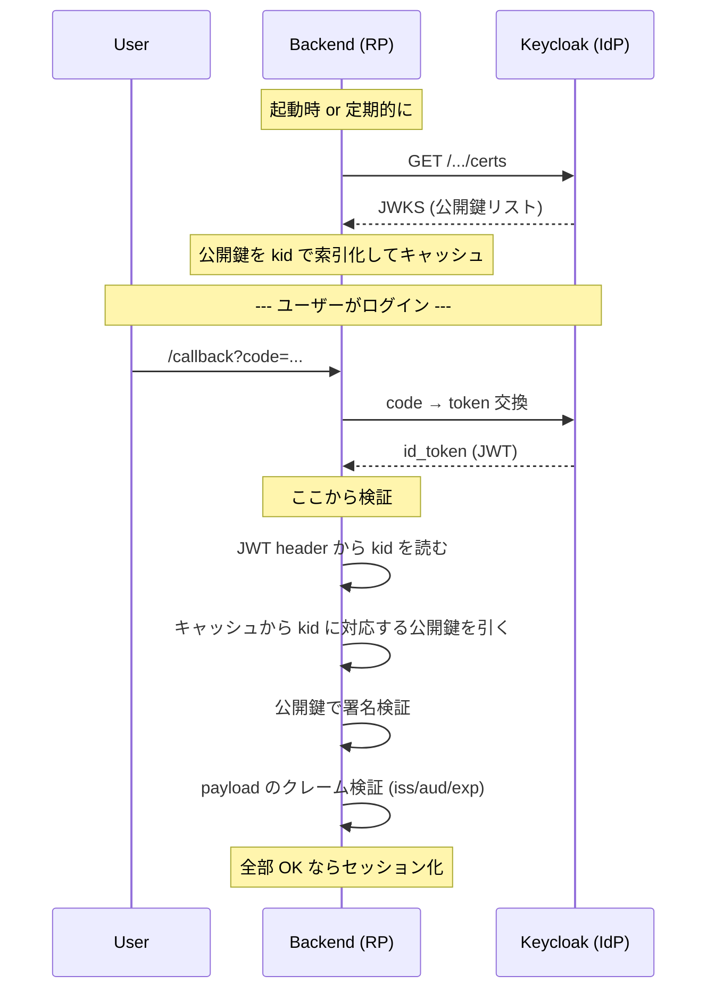

# 06. JWT 署名検証 — 概念編

OIDC で受け取る ID Token (= JWT) を「本当に IdP が発行したものか」を確認する仕組み。docs/01〜05 では token を Keycloak から HTTPS で受け取って payload を base64 デコードしているだけ → JWT を「JSON コンテナ」としてしか扱っていなかった。本回から JWT を **「署名で身元保証された JSON」** として扱う段階に入る。

実装はこの概念理解後に着手する (Sub A: JWKS フェッチ → Sub B: 署名検証 → Sub C: クレーム検証)。実装メモは完了後に本ドキュメントへ追記する。

## 1. JWT の中身 — 3 パート構造

JWT は 3 パートを `.` で繋いだ文字列:

```
eyJhbGciOiJSUzI1NiIs...   .   eyJzdWIiOiI1NjMyM...   .   X3JhJyc4kI...
       header                       payload                  signature
```

| パート | 中身 (base64url decode 後) | 例 |
|---|---|---|
| header | アルゴリズムと **どの鍵で署名したか (`kid`)** | `{"alg":"RS256","kid":"abc123"}` |
| payload | クレーム (`sub`, `iss`, `aud`, `exp` など) | `{"sub":"alice","exp":1735689600,"aud":"echo-app"}` |
| signature | header と payload に対する電子署名 | バイナリを base64url したもの |

**header と payload は誰でも読める** — base64url は単なるエンコードであり暗号ではない。価値はすべて signature が **「IdP しか作れない」** ことに集約されている。

逆に言うと: **「signature を検証していない JWT」は payload を任意に書き換え可能なただの JSON とほぼ同じ**。docs/05 までの実装はこれに該当している。

## 2. 署名 = 公開鍵暗号 (非対称鍵)

ここが理解の中核。



| 鍵 | 持つ人 | やれること |
|---|---|---|
| **秘密鍵** | IdP (Keycloak) のみ | 署名を**作る** |
| **公開鍵** | 世界中の誰でも (公開してよい) | 署名を**検証**するだけ。**作れない** |

これが **非対称鍵暗号 (asymmetric cryptography)** の中核性質。`RS256` = RSA + SHA256 の意味。

OIDC は IdP と RP を分離する以上、**必ず非対称鍵を使う**。対称鍵 (`HS256` = HMAC) を使ってしまうと、検証側 (RP) も JWT を作れることになり「IdP が発行した」を保証できなくなる。

## 3. 「署名検証」は具体的に何をする操作か



ハッシュが一致することの意味:

- **`header.payload` 部分が 1 ビットも変わっていない** = 改ざんされていない
- **その signature は秘密鍵を持つ者にしか作れない** = IdP が作ったものだ

の 2 つを同時に証明する。これが RSA の数学的性質 (公開鍵で復号できるのは対応する秘密鍵で署名されたものだけ) に依存している。

## 4. 公開鍵をどう入手するか — JWKS

Backend が IdP の公開鍵を持っていないと検証できない。**ハードコードはダメ** (IdP は鍵をローテーションする)。OIDC は「IdP が公開鍵を JSON で配信する規格」を持つ — これが **JWKS (JSON Web Key Set)**。

Keycloak の場合、エンドポイントは:

```
/realms/auth-tuto/protocol/openid-connect/certs
```

レスポンス例 (簡略):

```json
{
  "keys": [
    {
      "kid": "abc123",
      "kty": "RSA",
      "alg": "RS256",
      "n": "0vx7agoebGcQSuuPiLJX...",
      "e": "AQAB"
    },
    { "kid": "old-key-456", "...": "..." }
  ]
}
```

| フィールド | 意味 |
|---|---|
| `kid` | Key ID。JWT header の `kid` と突き合わせる索引 |
| `kty` | Key Type。`RSA` か `EC` |
| `alg` | 想定アルゴリズム (`RS256` など) |
| `n`, `e` | RSA 公開鍵の構成要素 (modulus と exponent)。これから `*rsa.PublicKey` を組み立てる |

### なぜ複数キーを返すのか — 鍵ローテーション



鍵をローテーションしても、**過渡期に古い鍵で署名された JWT がまだ有効期限内** であることがある。新旧両方を一定期間配信することで両方検証可能な状態を保つ。これが JWKS が単一鍵ではなく **配列** になっている理由。

## 5. 全体の流れ (Backend 視点)



## 6. なぜ HTTPS だけでは不十分なのか

「Keycloak から HTTPS で取ってきたんだから、安全じゃないの?」という問いに先回りして答える。

HTTPS が保証するのは:

- 通信路の**盗聴防止** (途中で覗かれない)
- 通信路の**改ざん防止** (途中で書き換えられない)
- 通信相手の**サーバ認証** (TLS 証明書で「確かに keycloak.example.com と話している」)

つまり HTTPS は **「2 点間の通信」だけ** を守る。

JWT 署名検証が解くのは別の脅威:

| 脅威 | HTTPS で防げるか | JWT 署名で防げるか |
|---|---|---|
| 通信途中で MITM が JWT を書き換える | ✅ | ✅ |
| 攻撃者が偽の JWT を URL fragment / Cookie / postMessage で持ち込む | ❌ | ✅ |
| JWT を別のサービスから流用される (audience 混同) | ❌ | ✅ (`aud` クレーム検証) |
| JWT を盗んで有効期限切れ後に使う | ❌ | ✅ (`exp` クレーム検証) |
| Resource Server が「自分宛じゃない IdP」の JWT を信じてしまう | ❌ | ✅ (`iss` クレーム検証) |

特に Resource Server を分離した瞬間、JWT は Authorization ヘッダで持ち運ばれて様々な経路を経由する → **JWT 自体が単独で身元保証できないと話にならない**。

現状のリポジトリ構成 (token を Keycloak から直接受け取り、Backend のメモリに留めるだけ) でも、**理屈上は `handleCallback` は「payload を信じて良い理由」を持っていない**。HTTPS が「Keycloak と話している」を保証してくれている恩恵で結果的に安全になっているだけで、本来の OIDC 仕様としては署名検証が必須。

## 7. 周辺の補足

### `crypto/rsa` での「公開鍵で復号」って何

正確には RSA の検証は「復号」ではなく **「signature を公開鍵で変換するとパディング付きハッシュ値が得られる、それを検算」** する操作。Go では `rsa.VerifyPKCS1v15(pub, crypto.SHA256, hashed, sig)` 一発で済む。手書きする部分はこの呼び出しの **前後の準備**:

1. `header.payload` 文字列を SHA256 でハッシュ
2. JWKS の `n` (modulus), `e` (exponent) から `*rsa.PublicKey` を組み立て
3. signature を base64url decode してバイト列に戻す
4. `VerifyPKCS1v15` を呼んでエラー無しなら検証成功

### JWKS のキャッシュ TTL

定石は **数分 〜 1 時間**。短すぎると IdP に負荷、長すぎると鍵ローテーション直後に新キーの JWT を弾く時間が伸びる。Keycloak のデフォルトは Cache-Control ヘッダで `max-age=600` (10 分) を返してくる。本リポジトリでは Sub A で **起動時 1 回フェッチのみ** から始めて、後段で TTL キャッシュ化を検討する。

### `kid` がない / アルゴリズムを `none` に偽装する攻撃

JWT 検証の有名な脆弱性パターン:

- **`alg: none` 攻撃**: header に「アルゴリズムなし」と書かれた JWT を受理させて signature を素通しさせる
- **`alg: HS256` 偽装攻撃**: RS256 想定のサーバに HS256 と書いた JWT を投げる。HMAC は対称鍵なので、公開鍵を共有鍵として使って攻撃者が署名を作れてしまう (公開鍵は文字通り公開されている)

実装時に意識する原則: **「JWT 側の `alg` を信じて分岐するのではなく、検証側で受け入れる `alg` を `RS256` に固定する」**。`alg` フィールドはあくまで参考情報として読むだけ。

### ID Token vs Access Token

OIDC で受け取る token は 2 種類 (+ refresh):

| | 用途 | 形式 | 検証する人 |
|---|---|---|---|
| **ID Token** | 「誰がログインしたか」を RP に伝える | 必ず JWT | RP (Backend) |
| **Access Token** | API 呼び出しの認可情報 | JWT のことが多いが規格上は不透明 (opaque) でもよい | Resource Server |

本リポジトリ Sub A〜C では **ID Token** の検証を扱う。Access Token の検証は Resource Server 分離フェーズで別途扱う (構造は同じ)。

## 次のフェーズ

実装は 3 サブフェーズで進める:

- **Sub A**: JWKS フェッチ + キャッシュ (検証はしない)
- **Sub B**: RS256 署名検証を手書き
- **Sub C**: クレーム検証 (`iss` / `aud` / `exp` / `iat`)

各サブフェーズ完了後にこの doc に **「今回の実装」** セクションを追記する。

その先:

- **nonce** パラメータ (replay 対策、ID Token 検証の延長線。本 doc に追記する想定)
- **Resource Server 分離 + access_token 検証** (docs/07 候補)
- (発展) 標準ライブラリ (`go-jose`, `lestrrat-go/jwx`, `golang-jwt`) への置き換えと差分観察
